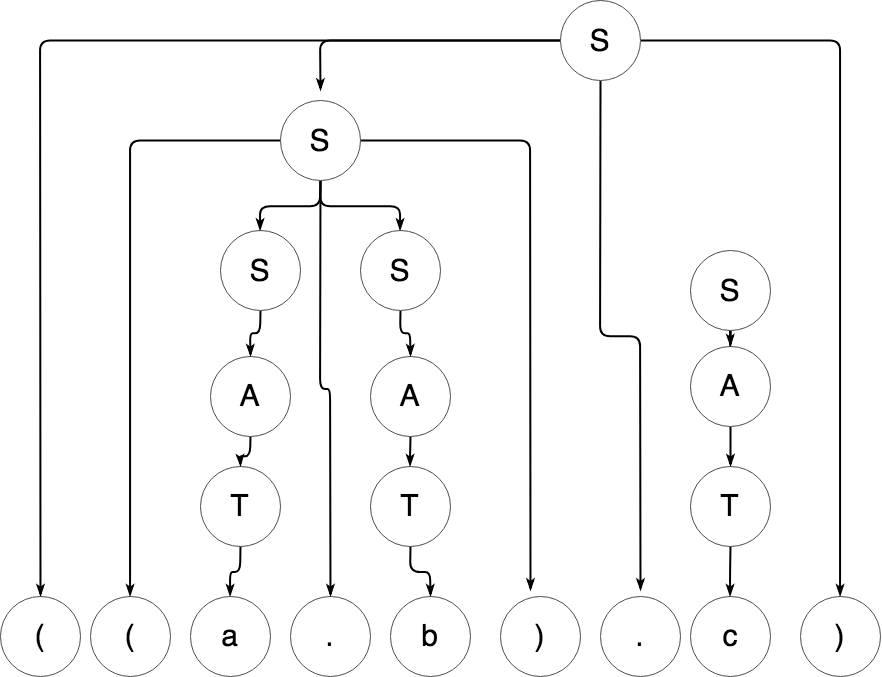

# Diseño de Compiladores - Análisis Sintáctico con el Lenguaje LISP


## Introducción

El analizador sintáctico se convierte en una herramienta principal en procesos que son guiados por la sintaxis. Esto es así gracias al alcance de la notación que se utiliza y delas herramientas de validación que se utilizan.

### Descripción

Dada una gramática, se utilizarán técnicas de análisis sintáctico predictivo para procesar cadenas de entradas. La gramática a analizar es el BNF del lenguaje LISP.

### Gramática: BNF del lenguaje LISP

```
s_exp -> atomic_symbol | "(" s_expresion "." s_expresion ")" | list
list -> "(" s_expresion* ")"
atomic_symbol -> letter atom_part
atom_part -> empty | letter atom_part | number atom_part
letter -> a | b | ... | z
number -> 1 | 2 | ... | 9
```

### Tratamiento de la gramática para el análisis:

Simplificando la gramática dada y verificando que cumpla con las condiciones (libre de ambigüedad, sin recursión por la izquierda y factor común:

```
S -> A | (S.S) | L
L -> (S*)
A -> ε | T | N
T -> a | b | ... | z
N -> 0 | 1 | ... | 9
```

Hallando el conjunto primero de cada producción:

```
P(S) = {ε, a...z, 0...9}
P(L) = {(}
P(A) = {ε, a...z, 0...9}
P(T) = {a...z}
P(N) = {0...9}
```

Los siguientes necesarios de los que tienen vacío ε son:

```
S(S) = {$, *}
S(A) = {$}
```

### Tabla para el análisis sintáctico:

|   | (        | . | ) | * | a...z | 0…1      | ε    | $ |
|---|----------|---|---|---|-------|----------|------|---|
| S | S->(S.S) |   |   | ε | S->A  |          | S->A | ε |
| L | L->(     |   |   |   |       |          |      |   |
| A |          |   |   | ε |       | A->N     | A->E | ε |
| T |          |   |   |   |       |          |      |   |
| N |          |   |   |   |       | N->0...9 |      |   |


### Análisis de cadenas

Cadena 1 para analizar:
```
(a1.(a2))
```

Análisis de la Cadena 1:

| Entrada    | Pila   | Acción   |
|------------|--------|----------|
| (a1.(a2))$ | S$     | -        |
| (a1.(a2))$ | (S.S)$ | S->(S.S) |
| a1.(a2))$  | S.S)$  | Consumo  |
| a1.(a2))$  | A.S)$  | S->A     |
| a1.(a2))$  | T.S)$  | A-T      |
| a1.(a2))$  | a.S)$  | T->a     |
| 1.(a2))$   | .S)$   | Consumo  |

La Cadena 1 no es válida, porque no se puede llegar a converger en la tabla.

De todas formas, para verificar que funciona el análisis, se probará con otra cadena mencionada en el libro de Elliot Organick [Programming Language Structures](https://www.amazon.com/Programming-Language-Structures-Elliott-Organick/dp/0125282605).


Cadena 2 para analizar:
```
((a.b).c)
```


Análisis de la Cadena 2:

| Entrada    | Pila      | Acción   |
|------------|-----------|----------|
| ((a.b).c)$ | S$        | -        |
| ((a.b).c)$ | (S.S)$    | S->(S.S) |
| (a.b).c)$  | S.S)$     | Consumo  |
| (a.b).c)$  | (S.S).S)$ | S->(S.S) |
| a.b).c)$   | S.S).S$   | Consumo  |
| a.b).c)$   | A.S).S$   | S->A     |
| a.b).c)$   | T.S).S)   | A->T     |
| a.b).c)$   | a.S).S$   | T->a     |
| .b).c)$    | .S).S)$   | Consumo  |
| b).c)$     | S).S)$    | Consumo  |
| b).c)$     | A).S)$    | S->A     |
| b).c)$     | T).S)$    | A->T     |
| b).c)$     | b).S$     | T->b     |
| ).c)$      | ).S)$     | Consumo  |
| .c)$       | .S)$      | Consumo  |
| c)$        | S)$       | Consumo  |
| c)$        | A)$       | S->A     |
| c)$        | T)$       | A->T     |
| c)$        | c)$       | T->c     |
| )$         | )$        | Consumo  |
| $          | $         | Consumo  |


La Cadena 2 es válida, porque se consume todo en la última fila.


### Otro método: Construcción del árbol
Podemos intentar construir un árbol sintáctico para las Cadenas 1 y 2. De todas formas, en el caso de la Cadena 1 que no es válida, en realidad no se puede llegar a construir un árbol completo, por lo tanto, iremos directamente por la Cadena 2:

Cadena 2:
```
((a.b).c)
```



En el gráfico del árbol observamos que la Cadena 2 fue aceptada y de esa manera fue posible construir un árbol válido con derivación por la izquierda.


### Conclusiones

El método de obtener la tabla de análisis sintáctico, y procesar una cadena resultó mucho más fácil, puesto que es un ejercicio mecánico y solamente es cuestión de seguir los pasos hasta llegar a verificar si hay convergencia para saber si la cadena es aceptada o no. (Estrategia del punto c especificado en la hoja del Trabajo Práctico).

LISP es un lenguaje sencillo pero potente, por eso la gramática en este caso no necesitó mucho tratamiento, sin embargo, se necesitó conocer e investigar un poco más sobre el lenguaje para entender su funcionamiento y probar las distintas cadenas.

La estrategia mencionada en el punto b del Trabajo Práctico resultó más complicada, porque implicó analizar con mayor detalle cada parte para crear los árboles y el código fuente. Si bien en el presente documento sólo hay un árbol, en las pruebas se hicieron otros y empleó mayor esfuerzo en pensar la construcción de los posibles árboles. Así también, para crear el código y probar fue necesario pensar más que en la estrategia de la tabla y consumición de caracteres o tokens a medida que el algoritmo iba hacia la convergencia.

Por último, una de las cosas más interesantes y sorprendentes es que con la estrategia de la tabla de análisis sintáctico se puede analizar bastante fácil y rápido una cadena, de hecho prácticamente cualquier cadena sin necesitar mucho poder de cómputo o análisis. Así como dice el libro de Aho en una parte, uno como diseñador de compiladores no puede saber cuál es la cadena exacta que será ingresada, así que la estrategia es hacer un compilador que pueda aceptar infinitas combinaciones de líneas de código y si toda la entrada está correcta, debería igual funcionar correctamente.


## Referencias

* **Elliott Organick, Alexandra Forsythe, Robert P. Plummer** - [Programming Language Structures](http://a.co/dDmn5wW)
* **Alfred V. Aho** - [Compilers: Principles, Techniques, and Tools 2nd](http://a.co/dx1BuoQ)


## Autor

José Pino
